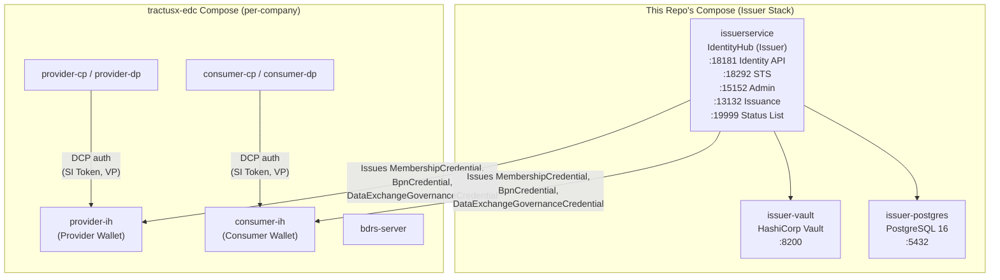
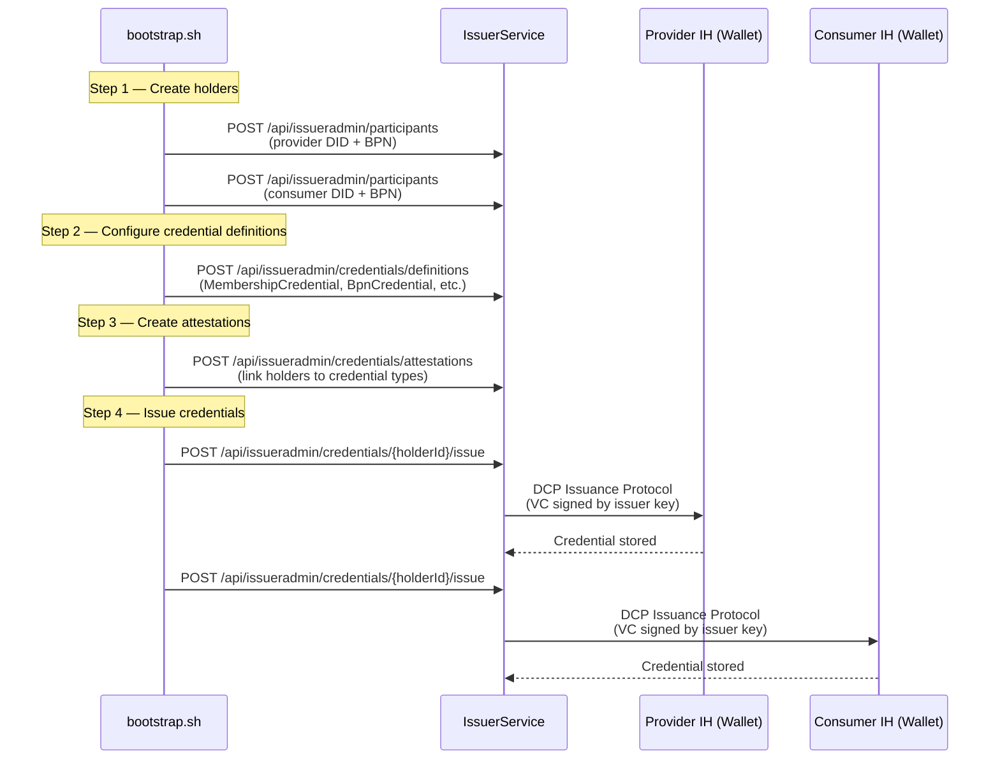

# Local Deployment — IssuerService

This directory provides a Docker Compose stack for the **IssuerService** — the shared
credential issuance authority in a Tractus-X dataspace. It is used alongside the
[tractusx-edc](https://github.com/Federity-X/public-tractusx-edc/tree/dcp) local deployment,
which manages per-company IdentityHub (wallet) instances.

## Architecture Overview

The IssuerService acts as the trusted credential authority in the dataspace,
issuing Verifiable Credentials to each company's IdentityHub wallet.



### Credential Issuance Flow



### ASCII Overview

```
┌─────────────────── This Repo's Compose ───────────────────┐
│                                                            │
│  issuer-postgres ─── issuerservice ─── issuer-vault        │
│     (5432)            (18181,15152,     (8200)             │
│                        13132,18292,                        │
│                        18100,19999)                        │
│                                                            │
└────────────────────────┬───────────────────────────────────┘
                         │  edc-net (shared Docker network)
┌────────────────────────┴───────────────────────────────────┐
│                                                            │
│            tractusx-edc Compose (per-company)               │
│                                                            │
│  provider-ih ── provider-vault ── provider-postgres         │
│  consumer-ih ── consumer-vault ── consumer-postgres         │
│  provider-cp ── provider-dp                                │
│  consumer-cp ── consumer-dp                                │
│  bdrs-server                                               │
│                                                            │
└────────────────────────────────────────────────────────────┘
```

**Key boundary**: This compose deploys _only_ the IssuerService stack.
Each company's IdentityHub wallet, Vault, and PostgreSQL are deployed by the
[EDC's `deployment/local/docker-compose.yaml`](https://github.com/Federity-X/public-tractusx-edc/tree/dcp/deployment/local).

## Prerequisites

- Docker & Docker Compose
- Java 21+ (for building shadow JARs)
- `jq` and `curl` (for testing)

## Quick Start

```bash
# 1. Create the shared Docker network (one-time)
docker network create edc-net

# 2. Build shadow JARs
cd /path/to/tractusx-identityhub
./gradlew :runtimes:identityhub:shadowJar :runtimes:issuerservice:shadowJar

# 3. Start IssuerService stack
cd deployment/local
docker compose up --build -d

# 4. Verify health
curl -s http://localhost:18181/api/check/health | jq .
```

## What's in This Directory

| File | Purpose |
|------|---------|
| `docker-compose.yaml` | IssuerService + Postgres + Vault |
| `config/issuerservice.properties` | IssuerService runtime config |
| `config/identityhub.properties` | **Reference config** for EDC teams deploying per-company IdentityHub instances |
| `config/logging.properties` | Shared JUL logging config |
| `config/init-databases.sql` | Creates the BDRS database on issuer-postgres |
| `test-wallet-api.sh` | API validation script (requires the full EDC+IH+IS stack) |

## Port Reference

### IssuerService (deployed by this compose)

| Host Port | Container Port | Context | Description |
|-----------|---------------|---------|-------------|
| 18181 | 8181 | default | Health checks, observability |
| 15152 | 15152 | issueradmin | Admin API (holders, attestations, credential definitions) |
| 13132 | 13132 | issuance | DCP issuance protocol |
| 18292 | 9292 | sts | STS token endpoint |
| 18100 | 80 | did | DID document resolution |
| 19999 | 9999 | statuslist | Credential status list |
| 5006 | 5005 | — | JVM remote debug |

### IdentityHub (deployed per-company by tractusx-edc)

| Port | Context | Description |
|------|---------|-------------|
| 8181 | default | Health checks |
| 15151 | identity | Management API (participant CRUD, keypairs, DIDs) |
| 13131 | credentials | DCP credentials (presentations, offers) |
| 9292 | sts | STS token endpoint |
| 10100 (→80) | did | DID document resolution |

> In the EDC compose, each company's IH gets unique host ports
> (e.g., provider: 7xxx, consumer: 8xxx).

## Reference Config: identityhub.properties

The `config/identityhub.properties` file is a **reference configuration** for EDC teams
who deploy per-company IdentityHub instances. It shows:
- All required endpoint definitions
- Datasource configuration (one shared DB with named stores)
- Vault configuration for HashiCorp Vault
- STS / IAM settings
- Super-user API key setup

EDC teams should copy this into their own compose and adjust:
- `edc.vault.hashicorp.url` → point to the company's own Vault
- `edc.datasource.*.url` → point to the company's own Postgres
- `edc.hostname` → the container name of the IdentityHub instance

## Running the Test Script

`test-wallet-api.sh` validates all IdentityHub + IssuerService APIs. It requires
the **full stack** (IH + IS + their infrastructure) to be running:

```bash
# Start IssuerService (this repo)
cd tractusx-identityhub/deployment/local
docker compose up --build -d

# Start per-company IH + EDC connectors (tractusx-edc repo)
cd tractusx-edc/deployment/local
docker compose up --build -d

# Run tests
cd tractusx-identityhub/deployment/local
chmod +x test-wallet-api.sh
./test-wallet-api.sh
```

## Dockerfiles (Local Dev Note)

The Dockerfiles on this branch have the OTEL Java agent COPY and ENTRYPOINT lines
commented out for local development (the `dockerize` Gradle task that builds production
images uses build args for OTEL). This is intentional — local `docker compose build`
doesn't supply OTEL JARs, and the commented lines avoid a build failure. The PR branch
(`feature/198-upgrade-edc-0.15.1`) has the original Dockerfiles intact.

## Further Reading

- [EDC DCP Wallet Integration Guide](../../docs/developers/EDC_DCP_WALLET_INTEGRATION.md) — full guide for EDC teams
- [EDC 0.15.1 Upgrade Fixes](../../docs/admin/EDC_0.15.1_UPGRADE_FIXES.md) — all 14 fixes applied during the upgrade
- [Migration Guide](../../docs/admin/migration-guide.md) — step-by-step upgrade from EDC 0.14.0
- [EDC Local Deployment README](https://github.com/Federity-X/public-tractusx-edc/tree/dcp/deployment/local) — the per-company EDC + IdentityHub stack
- [EDC Issues & Fixes](https://github.com/Federity-X/public-tractusx-edc/tree/dcp/docs/development/local-dcp-issues-and-fixes.md) — 14-issue troubleshooting catalog
